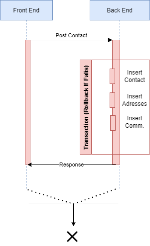

# MS3Contacts

Mulesoft API REST BackEnd API to manage CRUD operation over contacts 

## how to run it in debug mode

In anypoint studio debug arguments 
```bash
-M-XX:-UseBiasedLocking 
-M-Dfile.encoding=UTF-8 
-M-XX:+UseG1GC 
-M-XX:+UseStringDeduplication 
-DmuleKey=!muleKeyMS3!!!!! 
-Denv=dev
```
## unit test

This app has its own mule unit test process, here is the current coverage percentage

```
[INFO] ===============================================================================
[INFO] MUnit Coverage Summary
[INFO] ===============================================================================
[INFO]  * Resources: 7 - Flows: 18 - Processors: 81
[INFO]  * Application Coverage: 44.44%
[INFO] ====================================================================================
[INFO] MUnit Run Summary - Product: MULE_EE, Version: 4.3.0
[INFO] ====================================================================================
[INFO]  >> get-logics-test-suite.xml test result: Tests: 5, Errors: 0, Failures: 0, Skipped: 0
[INFO]
[INFO] ====================================================================================
[INFO]  > Tests:        5
[INFO]  > Errors:       0
[INFO]  > Failures:     0
[INFO]  > Skipped:      0
[INFO] ====================================================================================
```

To generate the jar file
```bash
mvn clean install -Denv=test
```

## GitHun Repository
```
https://github.com/horax77/MS3Contacts
```
## Postman Collection
```
https://www.getpostman.com/collections/261640e9ee7b395336b4
```
## Database DER


## Create Contact Sequence Diagram

